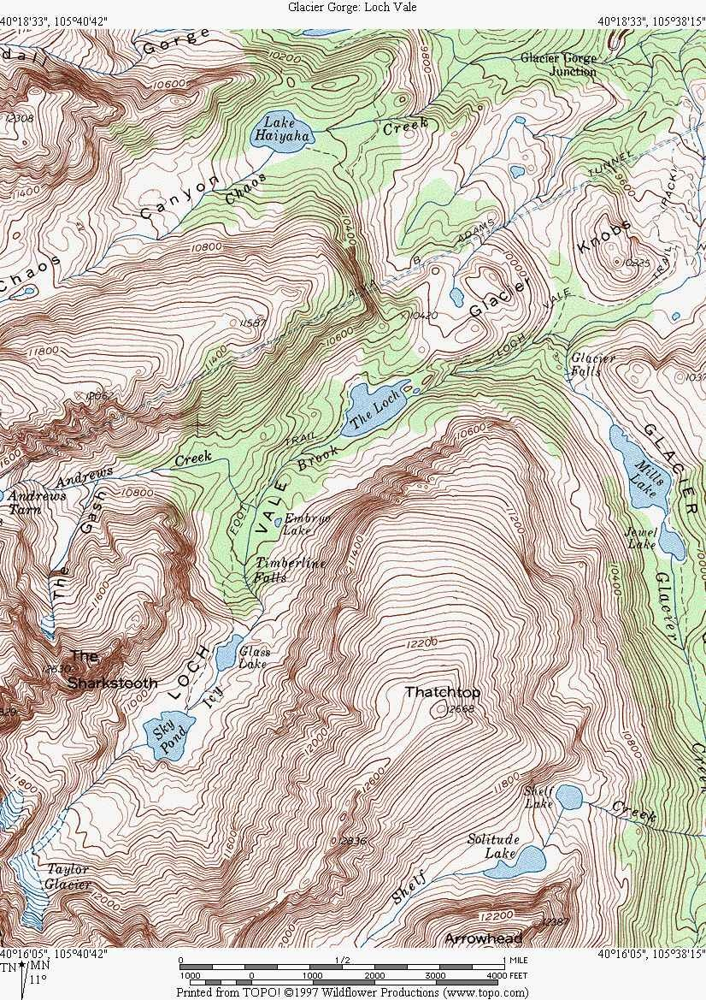

# 🎨 PROPOSITION D'AMÉLIORATION UI/UX - PREDATOR-PREY SIMULATION

## 📋 RÉSUMÉ EXÉCUTIF

L'interface actuelle (Canvas + Chart.js basique) est fonctionnelle mais manque de **profondeur scientifique** et d'**impact visuel**. Cette proposition transforme la simulation en un **véritable laboratoire d'écologie numérique** avec des visualisations dignes d'un outil de recherche professionnel.

---

## 🎯 OBJECTIFS PRINCIPAUX

| Objectif | Description |
|----------|-------------|
| **Scientifique** | Données exploitables, métriques pertinentes, visualisations avancées |
| **Immersif** | Expérience utilisateur captivante, animations fluides, feedback temps réel |
| **Professionnel** | Design épuré, cohérent, avec une identité visuelle forte |
| **Interactif** | Contrôles fins, exploration des données, personnalisation |

---

## 🖥️ NOUVELLE ARCHITECTURE UI


---

## 🎨 THÈME VISUEL (TECHNOLOGIE / SCI-FI)

### **Palette de couleurs**

| Usage | Couleur | Hex | Exemple |
|-------|---------|-----|---------|
| Fond global | Noir profond | `#0a0a0f` | ⬛ |
| Glassmorphism | Semi-transparent | `rgba(255,255,255,0.05)` | 🪟 |
| Texte principal | Blanc cassé | `#e8e8f0` | 📄 |
| Texte secondaire | Gris technique | `#8888aa` | 📝 |
| Proies (primaire) | Vert néon | `#00ff88` | 🟢 |
| Prédateurs (primaire) | Rouge sang | `#ff0044` | 🔴 |
| Accent 1 | Cyan technique | `#00ccff` | 🔵 |
| Accent 2 | Violet | `#8800ff` | 🟣 |
| Alertes / Danger | Orange | `#ff6600` | 🟠 |
| Succès / Équilibre | Vert | `#00cc66` | 🟩 |
| Bordure | Ultra-fin | `rgba(255,255,255,0.08)` | |

### **Typographie**

- **Titres** : `'JetBrains Mono', monospace` (style technique)
- **Corps** : `'Inter', sans-serif` (propre et lisible)
- **Data** : `'Roboto Mono', monospace` (pour les chiffres)

### **Effets visuels**

1. **Animation de fond** : Particules subtiles en mouvement (style Matrix)
2. **Glow effect** : Lueur autour des agents selon leur énergie
3. **Trails** : Traces de mouvement des agents (demi-vie 2s)
4. **Ondes** : Effet d'onde lors des prédations
5. **Scan line** : Lignes horizontales discrètes sur les graphiques

---

## 🔬 NOUVEAUX COMPOSANTS UI

### **1. KPI SCIENTIFIQUES AVANCÉS**

Au lieu de simples nombres, des indicateurs avec tendance :

```txt
┌─────────────────────────────────────────────────────────────────────┐
│  📊 MÉTRIQUES EN TEMPS RÉEL                                        │
├─────────────┬─────────────┬─────────────┬─────────────────────────┤
│ 1 245 Proies │ 342 Pred.   │ 3.64:1      │ 0.42/s  ← Taux pred.   │
│ ▲ +12%      │ ▼ -5%      │ ▲ +0.15    │ ████████░░ 78%          │
├─────────────┼─────────────┼─────────────┼─────────────────────────┤
│ 18.4 Energy  │ 125s        │ 00:23:45    │ 0.15/s  ← Taux reprod. │
│ ██████░░░░  │ ██████░░░░  │ ⏱️ Écoulé   │ ████░░░░░░ 32%          │
└─────────────┴─────────────┴─────────────┴─────────────────────────┘
```

**Chaque KPI affiche** :
- La valeur actuelle
- La tendance (▲ / ▼ / —)
- Une mini barre de progression (pourcentage par rapport au max historique)

### **2. SIMULATION AVANCÉE (Remplacer Canvas)**

**Proposition** : Utiliser **Pixi.js** (2D GPU accéléré) avec :

```txt
┌─────────────────────────────────────────────────────┐
│  🌍 SIMULATION EN TEMPS RÉEL                       │
│  ┌─────────────────────────────────────────────┐  │
│  │  🟢🟢🟢🔴🟢🔴🟢🟢🟢🔴🔴🟢🟢🟢🟢      │  │
│  │  🟢🟢🔴🟢🟢🟢🔴🟢🟢🟢🟢🟢🟢🔴🟢      │  │
│  │  🟢🟢🟢🟢🟢🔴🟢🟢🟢🟢🟢🟢🔴🟢🟢      │  │
│  │  🔴🟢🟢🟢🟢🟢🟢🟢🟢🟢🟢🟢🟢🟢🟢      │  │
│  │  🟢🟢🟢🟢🟢🟢🟢🟢🟢🟢🟢🟢🟢🟢🔴      │  │
│  │  🟢🟢🔴🟢🟢🟢🟢🟢🟢🟢🟢🟢🟢🟢🟢      │  │
│  └─────────────────────────────────────────────┘  │
│                                                   │
│  🎮 [▶ Pause]  ⏱️ 2.5x  📷 [Capture]  🎯 [Zoom] │
│  🐾 Proies: 1 245  🔴 Prédateurs: 342            │
└─────────────────────────────────────────────────────┘
```

**Fonctionnalités** :
- Agents avec effets de glow selon énergie
- Trails de mouvement (opacité décroissante)
- Animations lors des prédations (flash + onde)
- Zoom / Pan (roulette + drag)

### **3. DIAGRAMME DE PHASE INTERACTIF**

```txt
┌─────────────────────────────────────────────────────┐
│  🔄 DIAGRAMME DE PHASE (Lotka-Volterra)            │
│  ┌─────────────────────────────────────────────┐  │
│  │  Prédateurs ▲                              │  │
│  │          │  ●                             │  │
│  │          │   ● ●                          │  │
│  │          │    ●   ● ● ●                   │  │
│  │          │     ●        ● ●               │  │
│  │          │      ●           ● ●           │  │
│  │          │       ●             ● ●        │  │
│  │          │        ●               ● ●     │  │
│  │          │         ●                 ● ●  │  │
│  │          │          ●                   ●●│  │
│  │          └─────────────────────────────────▶│  │
│  │            Proies                         │  │
│  └─────────────────────────────────────────────┘  │
│                                                   │
│  📍 Point actuel: (1245, 342)                    │
│  🔄 Cycle: ~45 ticks (2.3s)                     │
│  📈 Phase: Croissance prédateurs                │
└─────────────────────────────────────────────────────┘
```

**Interactions** :
- Hover sur un point → affiche la valeur exacte
- Click → affiche les métriques à ce moment
- Animation du point (trace de l'évolution)
- Ligne de tendance

### **4. HEATMAP DE DENSITÉ**

```txt
┌─────────────────────────────────────────────────────┐
│  🗺️ CARTE DE DENSITÉ DES AGENTS                    │
│  ┌─────────────────────────────────────────────┐  │
│  │  ░░░░░░░░██████████░░░░░░░░░░░░            │  │
│  │  ░░░░░███████████████████░░░░░░            │  │
│  │  ░░██████████████████████████░░            │  │
│  │  ░█████████████████████████████            │  │
│  │  ███████████████████████████████            │  │
│  │  ░█████████████████████████████            │  │
│  │  ░░██████████████████████████░░            │  │
│  │  ░░░░░███████████████████░░░░░            │  │
│  └─────────────────────────────────────────────┘  │
│                                                   │
│  🟩 Proies ████████░░ 65%  │  🔴 Pred. ██░░ 35% │
│  🟡 Zone mixte: 12%        │  ⬜ Vide: 8%        │
└─────────────────────────────────────────────────────┘
```

**Avec** :
- Contour de densité
- Slider temporel pour voir l'évolution
- Légende de densité (gradient)

### **5. HISTOGRAMME ÉNERGIE**

```txt
┌─────────────────────────────────────────────────────┐
│  ⚡ DISTRIBUTION D'ÉNERGIE                         │
│  ┌─────────────────────────────────────────────┐  │
│  │  ████▌                                      │  │
│  │  ██████▌   Prédateurs                       │  │
│  │  ████████▌                                  │  │
│  │  ██████████▌  ██▌    Proies                 │  │
│  │  ████████████▌██████▌                       │  │
│  │  █████████████████████████                  │  │
│  │  └─────────────────────────────────────▶   │  │
│  │    0    10    20    30    40    50         │  │
│  └─────────────────────────────────────────────┘  │
│                                                   │
│  🟢 Proies: moyenne 22.4  │  🔴 Pred.: 18.7     │
│  📊 Médiane: 24.0        │  📈 Max: 41.2        │
└─────────────────────────────────────────────────────┘
```

**Avec** :
- Superposition des deux espèces
- Lignes de médiane / quartiles
- Tooltip avec valeurs exactes

### **6. COURBE DE SURVIE**

```txt
┌─────────────────────────────────────────────────────┐
│  📈 COURBE DE SURVIE (Kaplan-Meier)                │
│  ┌─────────────────────────────────────────────┐  │
│  │  100%▄▄▄▄▄▄▄▄▄▄▄▄▄▄▄▄▄▄▄▄▄▄▄▄▄▄▄▄▄          │  │
│  │       ████████████████████████████████▌     │  │
│  │   75%  ▐██████████████████████████████▌     │  │
│  │          ▐██████████████████████████▌       │  │
│  │   50%     ▐██████████████████████▌          │  │
│  │             ▐████████████████▌              │  │
│  │   25%        ▐████████████▌                 │  │
│  │                ▐████████▌                   │  │
│  │    0%          ▐██▌                        │  │
│  │  └─────────────────────────────────────▶   │  │
│  │   0s   20s   40s   60s   80s   100s        │  │
│  └─────────────────────────────────────────────┘  │
│                                                   │
│  🟢 Proies: espérance 47.2s                       │
│  🔴 Pred.: espérance 38.5s                       │
│  📊 Différence: -22%                             │
└─────────────────────────────────────────────────────┘
```

---

## 🎮 NOUVEAUX CONTRÔLES

### **1. Panel de contrôle avancé**

```txt
┌─────────────────────────────────────────────────────────┐
│  🎮 CONTRÔLES                                          │
├─────────────────────────────────────────────────────────┤
│  ▶️ [Play/Pause]  ⏭️ [Step]  🔄 [Reset]               │
├─────────────────────────────────────────────────────────┤
│  ⏱️ Vitesse: [████████░░░░] 2.5x                       │
│  🎯 Paramètres:                                        │
│     Rayon capture: [████░░░░] 30px                     │
│     Gain énergie:   [████████░░] 12                    │
│     Taux reprod.:   [██░░░░░░░░] 0.05                  │
├─────────────────────────────────────────────────────────┤
│  📥 Exporter: [CSV] [JSON] [PNG]                       │
│  📤 Importer: [Upload config]                          │
└─────────────────────────────────────────────────────────┘
```

### **2. Console de logs**

```txt
┌─────────────────────────────────────────────────────────┐
│  📋 CONSOLE DE LOG                                     │
├─────────────────────────────────────────────────────────┤
│  [12:34:56] 🟢 Reproduction: +42 proies               │
│  [12:34:56] 🔴 Prédation: 23 proies mangées            │
│  [12:34:56] ⚠️ Prédateur mort (épuisé)                │
│  [12:34:57] 🟢 Reproduction prédateurs: +6             │
│  [12:34:57] 📊 Ratio P/P: 3.64                        │
│  [12:34:58] 🔄 Cycle détecté: ~45 ticks               │
├─────────────────────────────────────────────────────────┤
│  ⚡ 1 245 proies  |  🔴 342 prédateurs  |  📈 +12%    │
└─────────────────────────────────────────────────────────┘
```

---

## 🚀 TECHNOLOGIES RECOMMANDÉES

### **Backend (Rust)**
| Technologie | Utilisation |
|-------------|-------------|
| Actix Web | Serveur HTTP actuel |
| Serde | JSON serialization |
| Rand | Génération aléatoire |
| **Nouveau** : Rayon | Parallélisation des calculs |
| **Nouveau** : Dashmap | Cache des métriques |

### **Frontend**
| Technologie | Utilisation | Alternative |
|-------------|-------------|-------------|
| **Pixi.js** | Rendu 2D accéléré GPU | Three.js (3D) |
| Chart.js | Graphiques de base | **Remplacé par D3.js** |
| **D3.js** | Visualisations avancées | Chart.js + plugins |
| **GSAP** | Animations fluides | Anime.js |
| **Popper.js** | Tooltips interactifs | Tippy.js |
| **FileSaver** | Export CSV/PNG | Blob |

### **Pourquoi ces choix ?**

| Graphique | Librairie | Raison |
|-----------|-----------|--------|
| Simulation temps réel | **Pixi.js** | 60 FPS avec 5000+ agents |
| Diagramme de phase | **D3.js** | Scatter plot interactif |
| Histogramme | **D3.js** | Distribution personnalisée |
| Heatmap | **D3.js** | Contour + interpolation |
| Courbe de survie | **D3.js** | Step chart + erreurs |
| Animation UI | **GSAP** | Transitions fluides |

---

**Total : 10 jours (2 semaines)**

---

## 📋 RÉSUMÉ DES AMÉLIORATIONS

| Avant | Après |
|-------|-------|
| Canvas 2D basique | Pixi.js 2D accéléré (5000+ agents) |
| 4 KPI simples | 7 KPI scientifiques avec tendances |
| 1 graphique (courbe) | 5 graphiques (courbe, phase, histo, heatmap, survie) |
| Design glassmorphism simple | Design techno avec animations et effets |
| Contrôles basiques | Contrôles avancés + exports + logs |
| 100 agents max | 5000+ agents à 60 FPS |

---

## 💡 CARTE
**Pour faire plus realiste et plus biologique utilisant une carte topographique**


**Au lieu d'un simple fond blanc**



---

## 💡 PROPOSITION FINALE

**Eviter un UI surchage**

