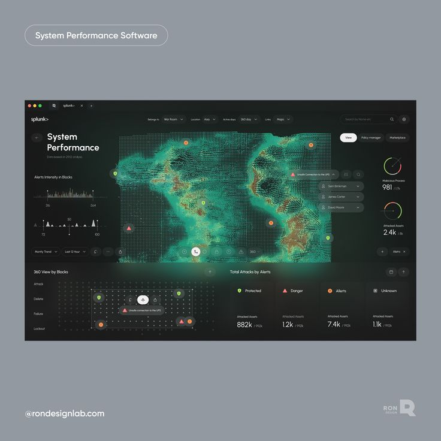
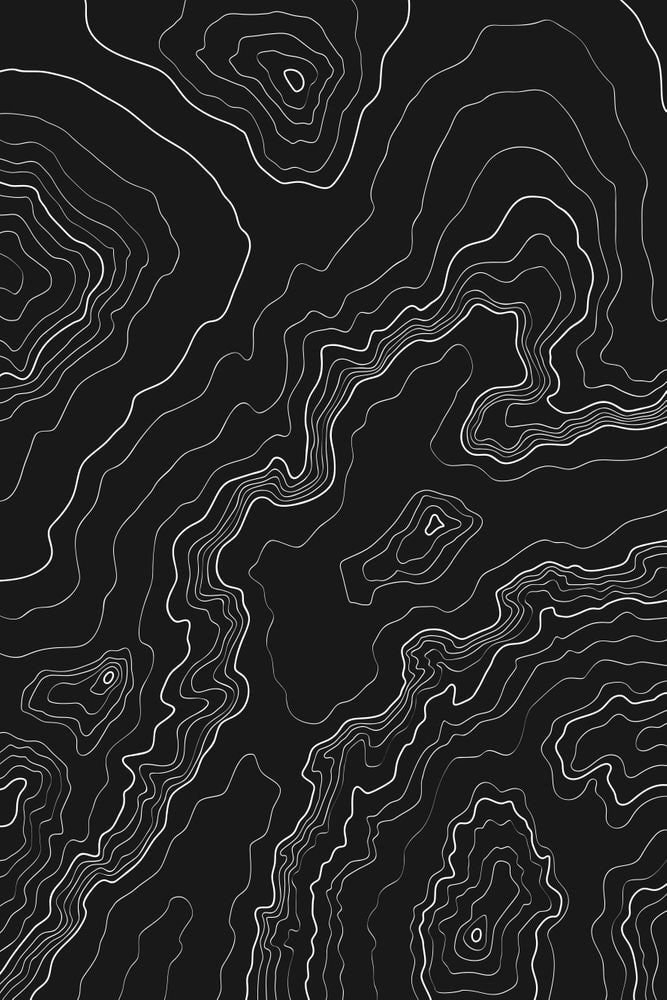

# SPÉCIFICATION DE REDESIGN UI/UX — PREDATOR-PREY SIMULATION

> Version 2.0 — Issue du PDF original, enrichie des décisions d'architecture prises en revue de code  
> Date : 2026-07-25  
> Statut : Prêt pour implémentation (frontend uniquement)

---

## RÉSUMÉ EXÉCUTIF

L’interface actuelle est fonctionnelle mais manque de profondeur scientifique et d’impact visuel.  
Cette refonte transforme la simulation en un **laboratoire d’écologie numérique** avec un design techno/immersif, des métriques pertinentes, et des visualisations avancées — tout en restant **fluide, non-surchargé et facile à maintenir**.

**Objectifs principaux** :

| Objectif | Description |
| :--- | :--- |
| Scientifique | Données exploitables, métriques avec tendances, graphiques interactifs |
| Immersif | Effets visuels (glow, trails, topographie), animations fluides 60 FPS |
| Professionnel | Dark theme, typographie technique, identité visuelle forte |
| Interactif | Contrôles fins (zoom/pan), onglets pour éviter la surcharge, sidebar rétractable |

---

## NOUVELLE HIÉRARCHIE VISUELLE (LAYOUT)
TOPBAR (titre, recherche, boutons autoplay/step)

SIDEBAR (rétractable en icône 60px) | ZONE DE SIMULATION (CENTRALE — rectangle)
                                    |   KPI hauts : Proies | Prédateurs | Total
                                    |   CANVAS PIXI (fond topographique)
                                    |   + agents avec glow, trails, ondes
                                    |   GRAPHIQUE ÉVOLUTION (Chart.js) | ONGLETS
                                    |   (population vs cycles)          | Phase
                                    |                                   | Densité
                                    |   7 KPI COMPACTS (avec tendances, tooltips)
                                    |   + histogramme énergie (mini)

Insipre toi de ceci:

**Remarques importantes** :
- La simulation occupe **la plus grande surface** (rectangle 16:9 ou 4:3 selon l'écran).
- Les KPI hauts sont **trois seulement** (proies, prédateurs, total) — lisibilité immédiate.
- Les 7 KPI avancés sont **en bas à droite**, compacts, avec tendance et tooltip au survol.
- Les graphiques supplémentaires (diagramme de phase, heatmap de densité) sont dans des **onglets** à droite du graphe d'évolution.
- La sidebar est **rétractable en icône** (60px) pour libérer de l'espace.
- Les **logs sont supprimés** (non pertinents).

---

## THÈME VISUEL (DARK / SCI-FI)

### Palette de couleurs

| Usage | Couleur | Hex | Exemple |
| :--- | :--- | :--- | :--- |
| Fond global | Noir profond | `#0a0a0f` | ████████ |
| Glassmorphism | Semi-transparent | `rgba(255,255,255,0.05)` | |
| Texte principal | Blanc cassé | `#e8e8f0` | |
| Texte secondaire | Gris technique | `#8888aa` | |
| Proies (primaire) | Vert néon | `#00ff88` | ● |
| Prédateurs (primaire) | Rouge sang | `#ff0044` | ● |
| Accent 1 | Cyan technique | `#00ccff` | ● |
| Accent 2 | Violet | `#8800ff` | ● |
| Alertes / Danger | Orange | `#ff6600` | ● |
| Succès / Équilibre | Vert | `#00cc66` | ● |
| Bordure | Ultra-fin | `rgba(255,255,255,0.08)` | |

### Typographie

| Usage | Police | Exemple |
| :--- | :--- | :--- |
| Titres, chiffres KPI | `JetBrains Mono`, monospace | **128** |
| Corps, labels | `Inter`, sans-serif | Simulation |
| Données techniques | `Roboto Mono`, monospace | `0.045` |

### Effets visuels (sur le Canvas Pixi uniquement)

- **Fond topographique** : sprite statique (carte IGN ou courbes cyan/bleu) généré une fois.
- **Glow** : lueur autour des agents proportionnelle à leur énergie.
- **Trails** : traînées de mouvement avec opacité décroissante (demi-vie 2s).
- **Ondes** : effet circulaire lors des prédations (flash blanc + onde qui s'étend).
- **Scan line** (optionnel) : lignes horizontales discrètes sur le fond pour un style technique.
- **Aucune particule en arrière-plan** pour ne pas surcharger le GPU — le Canvas gère toute la magie.

---

## COMPOSANTS UI DÉTAILLÉS

### 1. Sidebar (rétractable)
- **Comportement** : bouton hamburger en haut à gauche ; réduite, elle devient une icône (largeur 60px) avec les icônes des actions principales (simulation, reset, config).
- **Contenu** : identique à l'actuel (navigation Simulation / Dashboard / Reset / Paramètres) + compteur d'agents en pied.

### 2. Topbar
- Inchangée mais style adapté au dark theme (textes blancs, icônes gris clair).
- Affiche le cycle et le tick en cours.

### 3. Simulation Canvas (Pixi.js)
- **Rendu** : Pixi.js (WebGL accéléré) pour supporter 5000+ agents à 60 FPS.
- **Fond** : carte topographique statique (image ou générée par shader). Couleurs : tons foncés avec courbes de niveau cyan/bleu.
- **Agents** : cercles avec effet de glow. Les proies en vert néon, les prédateurs en rouge sang.
- **Trails** : chaque agent laisse une trace qui s'estompe en 2 secondes.
- **Ondes de prédation** : lorsqu'un prédateur mange une proie, une onde circulaire blanche s'étend à partir du point de contact.
- **Zoom/Pan** : via molette de souris + drag (viewport sur le conteneur Pixi). Boutons +/- dans l'UI pour accessibilité.
- **Interpolation** : conserve le mécanisme actuel (`lerp` entre `previousAgents` et `currentAgents`).

### 4. KPI hauts (3)
- Affichés juste au-dessus du Canvas.
- Indicateurs : **Proies**, **Prédateurs**, **Total**.
- Style : grands chiffres en `JetBrains Mono`, couleur associée, label petit en dessous.

### 5. Graphique d'évolution (Chart.js)
- Emplacement : **bas à gauche**.
- Thème dark : fond transparent, grilles discrètes, couleurs néon.
- Données : affichées **par cycle** (pas par tick) — comme actuellement.
- Interaction : tooltip au survol (valeur précise).

### 6. Onglets (droite du graphe)
- Deux onglets : **"Phase"** et **"Densité"**.
- Contenu :
  - **Phase** : diagramme de dispersion (prédateurs vs proies) avec courbe de tendance et animation des points. Réalisé avec **D3.js** (un seul composant D3 pour minimiser la dette).
  - **Densité** : heatmap 2D avec contours de densité (calculée **côté serveur** tous les 10 cycles, puis affichée en snapshot) pour ne pas impacter les performances du Canvas.
- Par défaut, l'onglet "Phase" est affiché.

### 7. KPI avancés + histogramme énergie (bas à droite)
- **7 indicateurs** compacts, chacun avec :
  - Icône + label
  - Valeur actuelle (grande)
  - Tendance (▲ / ▼ / —) avec couleur
  - Mini barre de progression (par rapport au max historique)
- **Tooltip au survol** : affiche le max historique, le min, la moyenne, et la tendance sur 10 cycles.
- **Mini histogramme énergie** : distribution de l'énergie des prédateurs (barres verticales, 10 bins). Intégré dans le même bloc, en petit.

---

## TECHNOLOGIES RECOMMANDÉES

### Backend (Rust) — inchangé
- Actix Web, Serde, Rand, SQLite (rusqlite).

### Frontend (nouvelles librairies)

| Usage | Librairie | Justification |
| :--- | :--- | :--- |
| Rendu Canvas | **Pixi.js** | 60 FPS, 5000+ agents, effets glow/trails/ondes |
| Graphique principal | **Chart.js** (thème dark) | Léger, déjà intégré, parfait pour l'évolution temporelle |
| Diagramme de phase | **D3.js** | Seul composant D3 pour la flexibilité des scatter plots |
| Heatmap | **D3.js** + calcul serveur | On évite de calculer l'interpolation côté client |
| Animations UI | **GSAP** (optionnel) | Pour les transitions des onglets et KPI |
| Tooltips avancés | **Tippy.js** | Pour les tooltips des KPI (plus riche que le title HTML) |

---

## PLAN D'IMPLÉMENTATION (PRIORITAIRE)

### Étape 1 — Intégration de Pixi.js + thème Dark pur (3 jours)
- Remplacer le Canvas 2D par un renderer Pixi.
- Adapter `renderLoop` pour qu'il utilise le `PIXI.Application`.
- Appliquer le fond topographique statique.
- Mettre en place la caméra (zoom/pan) et les contrôles.

### Étape 2 — Redesign des KPI et mise en page (2 jours)
- Réorganiser le layout HTML en grille.
- Ajouter les 3 KPI hauts.
- Ajouter les 7 KPI bas à droite avec tooltips (Tippy.js).
- Intégrer le mini histogramme énergie.

### Étape 3 — Onglets et graphiques secondaires (3 jours)
- Implémenter le système d'onglets (Phase / Densité).
- Diagramme de phase avec D3.js (animé).
- Heatmap de densité (récupération et affichage des snapshots serveur).

### Étape 4 — Effets visuels et polish (2 jours)
- Trails et glow des agents.
- Ondes de prédation.
- Transitions (GSAP si nécessaire).
- Sidebar rétractable.

**Total estimé : 10 jours** (2 semaines) — scope cohérent pour un portfolio.

---

## PIÈGES À ÉVITER / DÉCISIONS STRATÉGIQUES

| Problème | Solution |
| :--- | :--- |
| Surcharge de librairies | Un seul composant D3 (phase) ; Chart.js pour le reste. |
| Heatmap en temps réel | Calcul côté serveur (tous les 10 cycles), snapshot statique. |
| Conflit de scroll (zoom) | Les contrôles de zoom sont dans l'UI (boutons + molette) ; la molette ne fait pas défiler la page dans la zone Canvas. |
| Logs inutiles | Supprimés. |
| Fond avec particules | Remplacé par une topographie statique, plus élégante et légère. |
| Surcouche visuelle | Les onglets permettent d'afficher/masquer les graphiques secondaires. Les KPI avancés restent compacts. |
| Performance avec 5000 agents | Pixi.js gère, mais on limite le nombre de trails (demi-vie 2s) et les ondes ne persistent pas. |

---

## RÉSUMÉ DU CHANGEMENT PAR RAPPORT AU PDF ORIGINAL

| Point du PDF | Décision finale |
| :--- | :--- |
| Remplacer Chart.js par D3.js | **Non** — on garde Chart.js, on ajoute D3 seulement pour la phase. |
| Heatmap en temps réel | **Non** — calculée côté serveur, affichée en snapshot. |
| Console de logs | **Supprimée** — non pertinente pour l'utilisateur. |
| Particules en fond | **Supprimées** — on utilise une topographie statique. |
| Affichage permanent de tous les graphiques | **Non** — on utilise des onglets pour éviter la surcharge. |
| 7 KPI en permanence | **Oui**, mais compacts, avec tooltips pour les détails. |
| Sidebar fixe | **Rétractable** en icône (60px). |

---

- utilise une carte topographique comme fond de la zone de simulation

## RAPPEL DES CONTRAINTES TECHNIQUES EXISTANTES

- Architecture JS modulaire : `core/` (api, simulation, chart) + `components/` (sidebar, config-modal, kpi).
- L'état global est dans `api.js` (`state`, `previousAgents`, `currentAgents`).
- Le backend expose `/api/state`, `/api/tick`, `/api/reset`, `/api/toggle-pause`, `/api/configs`, `/api/apply-config-direct`.
- Les agents ont `id`, `x`, `y`, `species` (Prey/Predator), `energy` (pour les prédateurs).

**Cette spécification est verrouillée. Plus aucun changement fonctionnel ou visuel ne sera apporté avant la fin de l'implémentation.**